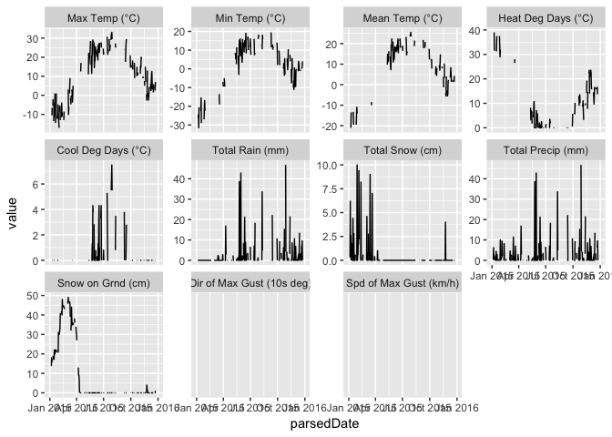
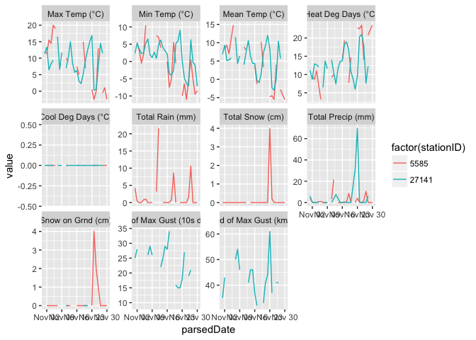

R Package rclimateca
================
Dewey Dunnington
12/6/2016

Fetching data from Environment Canada's archive has always been a bit of a chore. In the old days, it was necessary to download data one click at a time from the [organization's search page](http://climate.weather.gc.ca/historical_data/search_historic_data_e.html). To bulk download hourly data would require a lot of clicks and a good chance of making a mistake and having to start all over again. There are several R solutions online (posted by [Headwater Analytics](http://www.headwateranalytics.com/blog/web-scraping-environment-canada-weather-data) and [From the Bottom of the Heap](http://www.fromthebottomoftheheap.net/2015/01/14/harvesting-canadian-climate-data/) ), but both solutions are mostly single-purpose, and don't solve the additional problem of trying to find climate locations near you. In the [rclimateca package](http://github.com/paleolimbot/rclimateca), I attempt to solve both of these problems to produce filtered, plot-ready data from a single command.

Installation
------------

Rclimateca is available on CRAN and can be installed using the `install.packages()`.

``` r
install.packages('rclimateca')
```

Finding climate stations
------------------------

We will start with finding sites near where you're interested in. Sometimes you will have a latitude and longitude, but most times you will have a town or address. Using the [prettymapr](https://cran.r-project.org/package=prettymapr) packages 'geocode' function, the `getClimateSites()` function looks up locations near you.

``` r
library(rclimateca)
getClimateSites("gatineau QC")
```

    ##                       Name Province Station ID Latitude (Decimal Degrees)
    ## 5648      OTTAWA CITY HALL  ONTARIO       4334                      45.43
    ## 5654  OTTAWA LA SALLE ACAD  ONTARIO       4339                      45.43
    ## 5656 OTTAWA LEMIEUX ISLAND  ONTARIO       4340                      45.42
    ## 5663         OTTAWA U OF O  ONTARIO       4346                      45.42
    ## 5662     OTTAWA STOLPORT A  ONTARIO       7684                      45.47
    ##      Longitude (Decimal Degrees) First Year Last Year
    ## 5648                      -75.70       1966      1975
    ## 5654                      -75.70       1954      1967
    ## 5656                      -75.73       1953      1979
    ## 5663                      -75.68       1954      1955
    ## 5662                      -75.65       1974      1976

If you also need data for a set of years, you can also pass a vector of years to further refine your data.

``` r
getClimateSites("gatineau QC", year=2014:2016)
```

    ##                   Name Province Station ID Latitude (Decimal Degrees)
    ## 7147           CHELSEA   QUEBEC       5585                      45.52
    ## 5646        OTTAWA CDA  ONTARIO       4333                      45.38
    ## 5647    OTTAWA CDA RCS  ONTARIO      30578                      45.38
    ## 7154 OTTAWA GATINEAU A   QUEBEC      50719                      45.52
    ## 7155 OTTAWA GATINEAU A   QUEBEC      53001                      45.52
    ##      Longitude (Decimal Degrees) First Year Last Year
    ## 7147                      -75.78       1927      2016
    ## 5646                      -75.72       1889      2016
    ## 5647                      -75.72       2000      2016
    ## 7154                      -75.56       2012      2016
    ## 7155                      -75.56       2014      2016

If you'd like to apply your own subsetting operation, the entire dataset is also available through this package (although it may be slightly out of date).

``` r
data("climateLocs2016")
names(climateLocs2016)
```

    ##  [1] "Name"                        "Province"                   
    ##  [3] "Climate ID"                  "Station ID"                 
    ##  [5] "WMO ID"                      "TC ID"                      
    ##  [7] "Latitude (Decimal Degrees)"  "Longitude (Decimal Degrees)"
    ##  [9] "Latitude"                    "Longitude"                  
    ## [11] "Elevation (m)"               "First Year"                 
    ## [13] "Last Year"                   "HLY First Year"             
    ## [15] "HLY Last Year"               "DLY First Year"             
    ## [17] "DLY Last Year"               "MLY First Year"             
    ## [19] "MLY Last Year"

Downloading data
----------------

Downloading data is accomplished using the `getClimateData()` function, or if you'd like something less fancy, the `getClimateDataRaw()` function. There is documentation in the package for both, but `getClimateData()` has all the bells and whistles, so I will go over its usage first. You will first need a `stationID` (or a vector of them) - in our case I'll use the one for Chelsea, QC, because I like [the ice cream there](http://www.lacigaleicecream.ca/).

``` r
df <- getClimateData(5585, timeframe="daily", year=2015)
str(df)
```

    ## 'data.frame':    365 obs. of  29 variables:
    ##  $ stationID                : num  5585 5585 5585 5585 5585 ...
    ##  $ Date/Time                : chr  "2015-01-01" "2015-01-02" "2015-01-03" "2015-01-04" ...
    ##  $ Year                     : int  2015 2015 2015 2015 2015 2015 2015 2015 2015 2015 ...
    ##  $ Month                    : int  1 1 1 1 1 1 1 1 1 1 ...
    ##  $ Day                      : int  1 2 3 4 5 6 7 8 9 10 ...
    ##  $ Data Quality             : logi  NA NA NA NA NA NA ...
    ##  $ Max Temp (°C)            : num  NA NA NA NA -16.5 NA NA -10.5 -6.5 NA ...
    ##  $ Max Temp Flag            : chr  "M" "M" "M" "M" ...
    ##  $ Min Temp (°C)            : num  NA NA NA NA NA -26 -24.5 -31.5 -20.5 NA ...
    ##  $ Min Temp Flag            : chr  "M" "M" "M" "M" ...
    ##  $ Mean Temp (°C)           : num  NA NA NA NA NA NA NA -21 -13.5 NA ...
    ##  $ Mean Temp Flag           : chr  "M" "M" "M" "M" ...
    ##  $ Heat Deg Days (°C)       : num  NA NA NA NA NA NA NA 39 31.5 NA ...
    ##  $ Heat Deg Days Flag       : chr  "M" "M" "M" "M" ...
    ##  $ Cool Deg Days (°C)       : num  NA NA NA NA NA NA NA 0 0 NA ...
    ##  $ Cool Deg Days Flag       : chr  "M" "M" "M" "M" ...
    ##  $ Total Rain (mm)          : num  NA NA NA NA 0 0 0 0 0 0 ...
    ##  $ Total Rain Flag          : chr  "M" "M" "M" "M" ...
    ##  $ Total Snow (cm)          : num  NA NA NA NA 0.3 6.2 0.5 2.6 0 NA ...
    ##  $ Total Snow Flag          : chr  "M" "M" "M" "M" ...
    ##  $ Total Precip (mm)        : num  NA NA NA NA 0.3 6.2 0.5 2.6 0 NA ...
    ##  $ Total Precip Flag        : chr  "M" "M" "M" "M" ...
    ##  $ Snow on Grnd (cm)        : int  NA NA NA NA 14 14 18 16 17 17 ...
    ##  $ Snow on Grnd Flag        : chr  "M" "M" "M" "M" ...
    ##  $ Dir of Max Gust (10s deg): logi  NA NA NA NA NA NA ...
    ##  $ Dir of Max Gust Flag     : logi  NA NA NA NA NA NA ...
    ##  $ Spd of Max Gust (km/h)   : logi  NA NA NA NA NA NA ...
    ##  $ Spd of Max Gust Flag     : logi  NA NA NA NA NA NA ...
    ##  $ parsedDate               : POSIXct, format: "2015-01-01" "2015-01-02" ...

Boom! Data! The package can also melt the data for you (à la [reshape2](https://cran.r-project.org/package=reshape2)) so that you can easily use [ggplot](https://cran.r-project.org/package=ggplot2) to visualize.

``` r
library(ggplot2)
df <- getClimateData(5585, timeframe="daily", year=2015, format="long")
ggplot(df, aes(parsedDate, value)) + geom_line() + 
  facet_wrap(~param, scales="free_y")
```

<!-- -->

The function can accept a vector for most of the parameters, which it uses to either download multiple files or to trim the output, depending on the parameter. How to Chelsea, QC and Kentville, NS stack up during the month of November (Pretty similar, as it turns out...)?

``` r
df <- getClimateData(c(5585, 27141), timeframe="daily", year=2015, month=11, format="long")
ggplot(df, aes(parsedDate, value, col=factor(stationID))) + 
  geom_line() + facet_wrap(~param, scales="free_y")
```

<!-- -->

You will also notice that a little folder called `ec.cache` has popped up in your working directory, which contains the cached files that were downloaded from the Environment Canada site. You can disable this by passing `cache=NULL`, but I don't suggest it, since the cache will speed up running the code again (not to mention saving Environment Canada's servers) should you make a mistake the first time.

This function can download a whole lot of data, so it's worth doing a little math for yourself before you overwhelm your computer with data that it can't all load into memory. As an example, I tested this function by downloading daily data for every station in Nova Scotia between 1900 and 2016, which took 2 hours, nearly crashed my compute,r and resulted in a 1.3 **gigabyte** data.frame. You can do a few things (like ensure `checkdate=TRUE` and, if you're using `format="long"`, `rm.na=T`) to make your output a little smaller, or you can pass `ply=plyr::a_ply` to just cache the files so you only have to download them the once.

A little on how it works
------------------------

The code behind this package is available on GitHub, but it is fairly extensive and designed to tackle all of the corner cases that make writing a package so much more difficult than a script that runs once. Essentially, it's very close to the solution posted on [From the Bottom of the Heap](http://www.fromthebottomoftheheap.net/2015/01/14/harvesting-canadian-climate-data/) and in the [documentation itself](ftp://client_climate@ftp.tor.ec.gc.ca/Pub/Get_More_Data_Plus_de_donnees/Readme.txt). From the documentation:

    for year in `seq 1998 2008`;do for month in `seq 1 12`;do wget --content-disposition "http://climate.weather.gc.ca/climate_data/bulk_data_e.html?format=csv&stationID=1706&Year=${year}&Month=${month}&Day=14&timeframe=1&submit= Download+Data" ;done;done

    WHERE; 
     year = change values in command line (`seq 1998 2008)
     month = change values in command line (`seq 1 12)
     format= [csv|xml]: the format output
     timeframe = 1: for hourly data 
     timeframe = 2: for daily data 
     timeframe = 3 for monthly data 
     Day: the value of the "day" variable is not used and can be an arbitrary value 
     For another station, change the value of the variable stationID
     For the data in XML format, change the value of the variable format to xml in the URL. 

This is, of course, the same as the `genURLS()` solution except for bash and wget instead of for R. This package uses the "format=csv" option, which produces a somewhat malformed CSV (there is quite a bit of header information). The "guts" of the read operation are as follows:

``` r
# download the file
library(httr)
url <- "http://climate.weather.gc.ca/climate_data/bulk_data_e.html?format=csv&stationID=1706&Year=2008&Month=5&Day=14&timeframe=1&submit=Download+Data"
connect <- GET(url)
x <- content(connect, as="text", encoding="UTF-8")

# find the second emtpy line and start the read.csv after that line
xlines <- readLines(textConnection(x))
empty <- which(nchar(xlines) == 0)
empty <- empty[empty != length(xlines)]
# read the data frame
df <- read.csv(textConnection(x), 
               skip=empty[length(empty)], 
               stringsAsFactors = F, check.names = F)
```

I am sure is cringing as I read the entirity of each CSV file into memory, but they should be reminded that (a) R is terrible for memory usage anyway, and (b) the files are already "chunked up" by Environment Canada so that there is no chance of getting an unwieldy-sized file by accident.

Wrapping it up
--------------

That's it! Hopefully now you can all download unlimited quantities of data in pure bliss (as long as Environment Canada keeps its URLs consistent).
